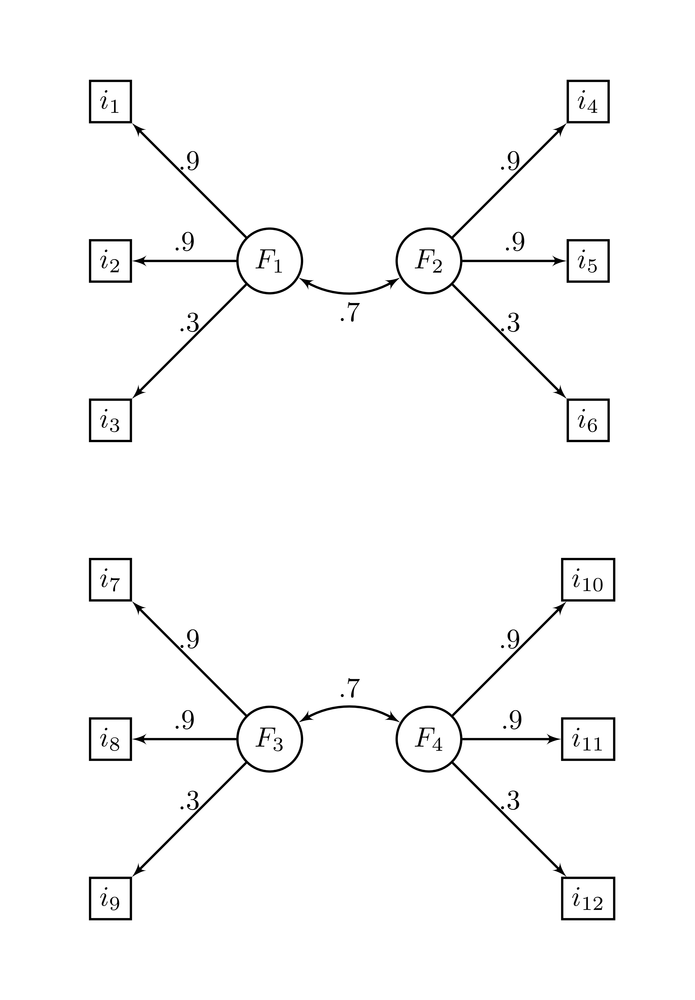

# SignalCancellation : An R package for

The library `SignalCancellation` offers the `scrof`, `SCROF`, or `SCRoF`
function for Signal cancellation recovery of factors (Achim, 2024,
2025).

<!-- (NEST; Achim, 2017; 2020) to determine the number of dimensions in exploratory factor analysis. It provides a main function `nest()` to carry the analysis, a `plot()` function a many utilit. It has been showed to amongst the best stopping rule to determine the nuber of factor in factor analysis [@Achim21;@Caron25;@Bran24]. -->
<!-- There is many examples of correlation matrices available with the packages and other stopping rules as well, such as `PA()` for parallel analysis or `MAP()` for minimum average partial correlation. -->
<!-- As of version `1.0`, `Rnest` is compatible with the `tidyverse` and the `%>%`. -->

# Installation

The development version can be accessed through GitHub:

``` r
remotes::install_github(repo = "quantmeth/SignalCancellation")
library(SignalCancellation)
```

The CRAN package will be available eventually.

``` r
# installed.packages("SignalCancellation")
# library(SignalCancellation)
```

<!-- # Examples -->
<!-- Here is an example using the `ex_4factors_corr` correlation matrix from the `Rnest` library [@Caron25]. The factor structure is -->
<!-- ```{r factstruct, echo = FALSE, out.height="50%", out.width="50%", imgcenter='center'} -->
<!--  -->
<!-- ``` -->
<!-- and the correlation matrix is -->
<!-- ```{r writecor, echo = FALSE, results='asis'} -->
<!-- #write_matex(ex_4factors_corr) -->
<!-- Rex <- ifelse(ex_4factors_corr == 0, "", sprintf("%.3f", ex_4factors_corr)) -->
<!-- diag(Rex) <- "1" -->
<!-- #Rex <- gsub("0.", x = Rex, ".") -->
<!-- Rex <- sub("^0+", "", Rex) -->
<!-- write_matex(Rex) -->
<!-- ``` -->
<!-- From `ex_4factors_corr`, we can easily generate random data using the `MASS` packages [@MASS]. -->
<!-- ```{r gendata} -->
<!-- set.seed(1) -->
<!-- mydata <- MASS::mvrnorm(n = 2500, -->
<!--                         mu = rep(0, ncol(Rnest::ex_4factors_corr)), -->
<!--                         Sigma = Rnest::ex_4factors_corr) -->
<!-- ``` -->
<!-- We can then carry NEST. -->
<!-- # ```{r scrof1} -->
<!-- # res <- scrof(N1000_1) -->
<!-- # res$ -->
<!-- # res$VG -->
<!-- # ``` -->
<!-- The first output tells hom many factors NEST suggests. We can also consult the summary with -->
<!-- ```{r summarynest} -->
<!-- summary(res) -->
<!-- ``` -->
<!-- We can visualize the results using the generic function `plot()` using the `nest()` output. -->
<!-- ```{r plot, fig.cap="Scree plot of NEST", imgcenter='center'} -->
<!-- plot(res) -->
<!-- ``` -->
<!-- The above figure shows the empirical eigenvalues in blue and the 95^th^ percentile of the sampled eigenvalues. -->
<!-- It is also possible to use a correlation matrix directly. A sample size, `n` must be supplied. -->
<!-- ```{r nest2} -->
<!-- nest(ex_4factors_corr, n = 240) -->
<!-- ``` -->
<!-- The `nest()` function can use with many $\alpha$ values and presents parallel analysis results if desired. -->
<!-- ```{r plot2, fig.cap="Scree plot of NEST with many $\\alpha$", imgcenter='center'} -->
<!-- res <- nest(ex_4factors_corr, n = 120, alpha = c(.01,.025,.05)) -->
<!-- plot(res, p
a = TRUE) -->
<!-- ``` -->
<!-- # Recommended usage -->
<!-- Recommended usage : fiml estimation for correlation matrix and removing unique variables. -->
<!-- ```{r tidynest, warning = FALSE, message = FALSE} -->
<!-- library(dplyr) -->
<!-- ex_3factors_doub_unique %>% -->
<!--   genr8(n = 200) %>%        # to generate simulated data for the example -->
<!--   cor_nest() %>%   -->
<!--   remove_unique() %>%        -->
<!--   nest() %>%  -->
<!--   plot(pa = TRUE) -->
<!-- ``` -->

# How to cite

Caron, P.-O. (2025). *SignalCancellation*.
<https://github.com/quantmeth/SignalCancellation>

# References

<div id="refs" class="references csl-bib-body hanging-indent"
entry-spacing="0" line-spacing="2">

<div id="ref-Achim24" class="csl-entry">

Achim, A. (2024). *Signal cancellation factor analysis*.
<https://doi.org/10.31234/osf.io/h7qwg>

</div>

<div id="ref-Achim25" class="csl-entry">

Achim, A. (2025). Signal cancellation recovery of factors and
meta-factors. In J.-S. Kim, H. Wu, T. Sweet, & D. Molenaar (Eds.),
*Proceedings of the international meeting of the psychometric society:
The 89th annual meeting* (pp. 1–9). Springer.

</div>

</div>
