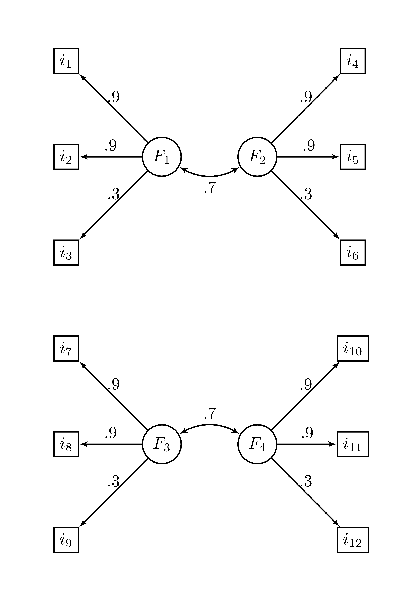

# SignalCancellation : An R package for Signal Cancellation Analysis

The library `SignalCancellation` offers the `scrof`, `SCROF`, or `SCRoF`
function for Signal cancellation recovery of factors (Achim, 2024).

<!-- (NEST; Achim, 2017; 2020) to determine the number of dimensions in exploratory factor analysis. It provides a main function `nest()` to carry the analysis, a `plot()` function a many utilit. It has been showed to amongst the best stopping rule to determine the nuber of factor in factor analysis [@Achim21;@Caron25;@Bran24]. -->
<!-- There is many examples of correlation matrices available with the packages and other stopping rules as well, such as `PA()` for parallel analysis or `MAP()` for minimum average partial correlation. -->
<!-- As of version `1.0`, `Rnest` is compatible with the `tidyverse` and the `%>%`. -->

# Installation

The development version can be accessed through GitHub:

``` r
remotes::install_github(repo = "quantmeth/SignalCancellation")
library(SignalCancellation)
```

The CRAN package will be available eventually.

``` r
# installed.packages("SignalCancellation")
# library(SignalCancellation)
```

# Examples

Here is an example using the `ex_4factors_corr` correlation matrix from
the `Rnest` library (Caron, 2025). The factor structure is

<p align="center">

</p>

and the correlation matrix is

$$\begin{bmatrix}
1&.810&.270&.567&.567&.189&&&&&& \\
.810&1&.270&.567&.567&.189&&&&&& \\
.270&.270&1&.189&.189&.063&&&&&& \\
.567&.567&.189&1&.810&.270&&&&&& \\
.567&.567&.189&.810&1&.270&&&&&& \\
.189&.189&.063&.270&.270&1&&&&&& \\
&&&&&&1&.810&.270&.567&.567&.189 \\
&&&&&&.810&1&.270&.567&.567&.189 \\
&&&&&&.270&.270&1&.189&.189&.063 \\
&&&&&&.567&.567&.189&1&.810&.270 \\
&&&&&&.567&.567&.189&.810&1&.270 \\
&&&&&&.189&.189&.063&.270&.270&1 \\
\end{bmatrix}$$

From `ex_4factors_corr`, we can easily generate random data using the
`MASS` packages (Venables & Ripley, 2002).

``` r
set.seed(2)
mydata <- MASS::mvrnorm(n = 240,
                        mu = rep(0, ncol(Rnest::ex_4factors_corr)),
                        Sigma = Rnest::ex_4factors_corr)
```

We can then carry signal cancellation factor analysis (SCFA).

``` r
res <- scfa(mydata)
res$nfactors
```

    ## [1] 4

This output yields the number of factors.

We can also try the Tabachnick & Fidell (2019) correlation matrix
directly.

``` r
# remove unique variable
TF <- Rnest::tabachnick_fidell2019[-11,-11]
res <- scfa(TF, n = 175) 
res$nfactors
```

    ## [1] 2

The saturation and correlation between factors are found here (from
`test_k_dim`).

``` r
res$scfa[[1]]$satur
```

    ##              [,1]        [,2]
    ##  [1,]  0.05559173  -0.6634601
    ##  [2,]  0.56429449  -0.9807931
    ##  [3,] -0.05440381  -0.8052882
    ##  [4,]  0.54122032  -0.9888514
    ##  [5,]  0.75262152   0.0000000
    ##  [6,] -0.02290866  -1.2428200
    ##  [7,]  3.07623785  -3.4433515
    ##  [8,]  2.82460633  -4.4367350
    ##  [9,]  0.00000000   0.6427794
    ## [10,] 15.95627793 -16.7530141

``` r
res$scfa[[1]]$Rfct
```

    ##           [,1]      [,2]
    ## [1,] 1.0000000 0.6148903
    ## [2,] 0.6148903 1.0000000

There is a function to compute the correlation matrix by excluding
factors.

``` r
# does not work if no AB
# out <- factor_exclusion(res$AS)
# round(out$Corr,2)
```

Inspection can be done with the following function. It yields the
residual covariances, their *p*-values and partial correlations.

``` r
tf15 <- factor_test(AS = res$AS, c(1,5))
sapply(tf15, round, 2, simplify = FALSE)
```

    ## $residual.cov
    ##       b     c     d     f    g    h    i    j
    ## b    NA  0.61  0.22  0.78 0.01 0.48 0.03 0.02
    ## c  0.04    NA  0.97  0.54 0.70 0.13 0.26 0.23
    ## d  0.09  0.00    NA  0.89 0.04 0.03 0.58 0.12
    ## f -0.02  0.05 -0.01    NA 0.43 0.38 0.39 0.42
    ## g  0.20 -0.03  0.15 -0.06   NA 0.01 0.00 0.00
    ## h  0.05  0.11  0.16  0.06 0.18   NA 0.00 0.01
    ## i  0.16  0.08  0.04 -0.06 0.28 0.28   NA 0.00
    ## j  0.17 -0.09  0.11 -0.06 0.29 0.20 0.32   NA
    ## 
    ## $partial.cor
    ##       b     c     d     f     g    h     i     j
    ## b    NA  0.05  0.11 -0.02  0.22 0.06  0.18  0.19
    ## c  0.05    NA  0.00  0.05 -0.03 0.12  0.10 -0.09
    ## d  0.11  0.00    NA -0.01  0.17 0.18  0.05  0.13
    ## f -0.02  0.05 -0.01    NA -0.06 0.07 -0.07 -0.06
    ## g  0.22 -0.03  0.17 -0.06    NA 0.18  0.29  0.30
    ## h  0.06  0.12  0.18  0.07  0.18   NA  0.29  0.21
    ## i  0.18  0.10  0.05 -0.07  0.29 0.29    NA  0.33
    ## j  0.19 -0.09  0.13 -0.06  0.30 0.21  0.33    NA

there is also this.

``` r
inspection_scfa(res)
```

    ##    var1 var2  Prob  sat1  sat2 check
    ## 1     1    2 0.069 0.710 0.658      
    ## 2     1    3 0.140 0.828 0.597      
    ## 3     1    4 0.170 0.747 0.687      
    ## 4     1    5 0.268 0.791 0.790      
    ## 5     1    6 0.978 0.826 0.418      
    ## 6     1    7 0.000 0.621 0.370     *
    ## 7     1    8 0.001 0.701 0.288     *
    ## 8     1    9 0.000 0.582 0.394     *
    ## 9     1   10 0.000 0.714 0.259     *
    ## 10    2    3 0.005 0.705 0.556     *
    ## 11    2    4 0.452 0.716 0.712      
    ## 12    2    5 0.086 0.699 0.760      
    ## 13    2    6 0.201 0.699 0.337      
    ## 14    2    7 0.098 0.747 0.544      
    ## 15    2    8 0.112 0.560 0.333      
    ## 16    2    9 0.005 0.682 0.541     *
    ## 17    2   10 0.002 0.724 0.445     *
    ## 18    3    4 0.043 0.552 0.669     *
    ## 19    3    5 0.434 0.552 0.701      
    ## 20    3    6 0.912 0.645 0.417      
    ## 21    3    7 0.002 0.421 0.369     *
    ## 22    3    8 0.004 0.604 0.375     *
    ## 23    3    9 0.000 0.524 0.520     *
    ## 24    3   10 0.014 0.230 0.187     *
    ## 25    4    5 0.104 0.700 0.768      
    ## 26    4    6 0.642 0.694 0.374      
    ## 27    4    7 0.015 0.720 0.513     *
    ## 28    4    8 0.006 0.807 0.370     *
    ## 29    4    9 0.041 0.564 0.464     *
    ## 30    4   10 0.001 0.662 0.406     *
    ## 31    5    6 0.680 0.770 0.382      
    ## 32    5    7 0.001 0.675 0.423     *
    ## 33    5    8 0.018 0.521 0.254     *
    ## 34    5    9 0.000 0.721 0.412     *
    ## 35    5   10 0.000 0.586 0.316     *
    ## 36    6    7 0.020 0.199 0.378     *
    ## 37    6    8 0.012 0.309 0.480     *
    ## 38    6    9 0.022 0.186 0.391     *
    ## 39    6   10 0.003 0.124 0.281     *
    ## 40    7    8 0.194 0.557 0.446      
    ## 41    7    9 0.370 0.590 0.648      
    ## 42    7   10 0.883 0.618 0.588      
    ## 43    8    9 0.169 0.480 0.731      
    ## 44    8   10 0.144 0.461 0.550      
    ## 45    9   10 0.192 0.696 0.573

Further developments will follow.

<!-- The first output tells hom many factors NEST suggests. We can also consult the summary with -->
<!-- ```{r summarynest} -->
<!-- summary(res) -->
<!-- ``` -->
<!-- We can visualize the results using the generic function `plot()` using the `nest()` output. -->
<!-- ```{r plot, fig.cap="Scree plot of NEST", imgcenter='center'} -->
<!-- plot(res) -->
<!-- ``` -->
<!-- The above figure shows the empirical eigenvalues in blue and the 95^th^ percentile of the sampled eigenvalues. -->
<!-- It is also possible to use a correlation matrix directly. A sample size, `n` must be supplied. -->
<!-- ```{r nest2} -->
<!-- nest(ex_4factors_corr, n = 240) -->
<!-- ``` -->
<!-- The `nest()` function can use with many $\alpha$ values and presents parallel analysis results if desired. -->
<!-- ```{r plot2, fig.cap="Scree plot of NEST with many $\\alpha$", imgcenter='center'} -->
<!-- res <- nest(ex_4factors_corr, n = 120, alpha = c(.01,.025,.05)) -->
<!-- plot(res, p
a = TRUE) -->
<!-- ``` -->
<!-- # Recommended usage -->
<!-- Recommended usage : fiml estimation for correlation matrix and removing unique variables. -->
<!-- ```{r tidynest, warning = FALSE, message = FALSE} -->
<!-- library(dplyr) -->
<!-- ex_3factors_doub_unique %>% -->
<!--   genr8(n = 200) %>%        # to generate simulated data for the example -->
<!--   cor_nest() %>%   -->
<!--   remove_unique() %>%        -->
<!--   nest() %>%  -->
<!--   plot(pa = TRUE) -->
<!-- ``` -->

# How to cite

Caron, P.-O. & Achim, A. (2025). *SignalCancellation*.
<https://github.com/quantmeth/SignalCancellation>

# References

<div id="refs" class="references csl-bib-body hanging-indent"
entry-spacing="0" line-spacing="2">

<div id="ref-Achim24" class="csl-entry">

Achim, A. (2024). *Signal cancellation factor analysis*.
<https://doi.org/10.31234/osf.io/h7qwg>

</div>

<div id="ref-Caron25" class="csl-entry">

Caron, P.-O. (2025). A comparison of the next eigenvalue sufficiency
test to other stopping rules for the number of factors in factor
analysis. *Educational and Psychological Measurement*.
<https://doi.org/10.1177/00131644241308528>

</div>

<div id="ref-TB19" class="csl-entry">

Tabachnick, B. G., & Fidell, L. S. (2019). *Using multivariate
statistics*. Allyn; Bacon.

</div>

<div id="ref-MASS" class="csl-entry">

Venables, W. N., & Ripley, B. D. (2002). *Modern applied statistics with
S*. Springer. <https://www.stats.ox.ac.uk/pub/MASS4/>

</div>

</div>
